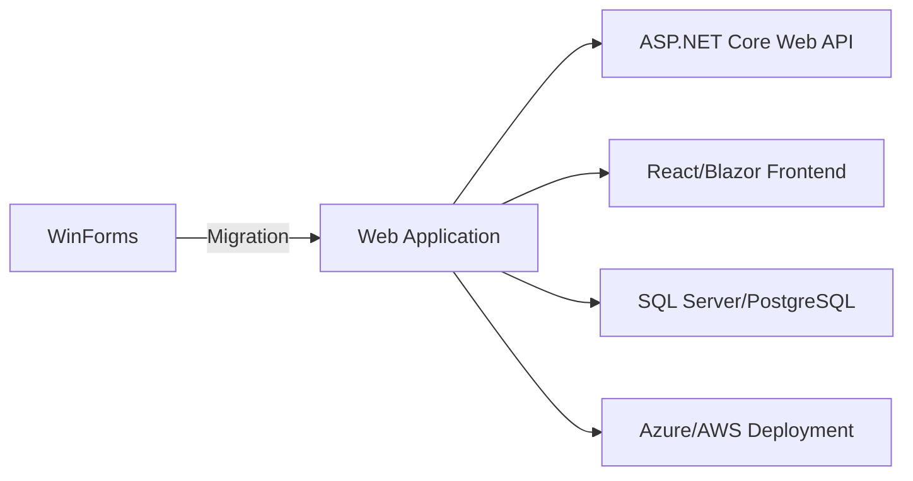
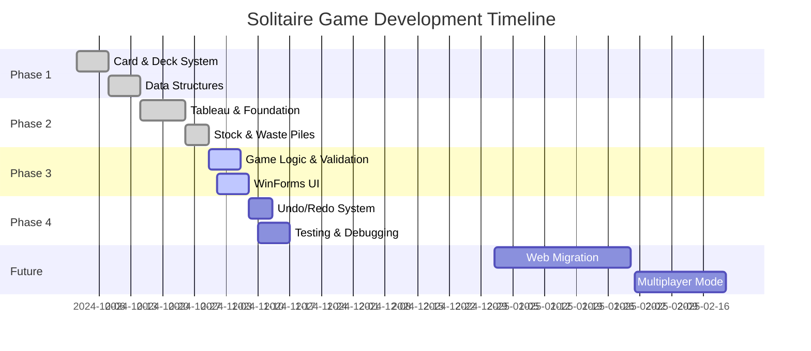

# <div align="center">🃏 **SOLITAIRE GAME - KLONDIKE EDITION** 🃏</div>

<!-- ✅ Typing Animation -->
<div align="center">
  
</div>

<div align="center">
  
</div>

<!-- 🖼️ Game GIF -->
<div align="center">
  
</div>

---

##  **About The Project**

```javascript
const SolitaireGame = {
    name: "Klondike Solitaire",
    course: "CSC200 - Data Structure & Algorithms",
    developer: "NADIR JAMAL",
    rollNumber: "2024-CS-38",
    currentStatus: "WinForms Implementation ✅",
    futureGoal: "Web-Based Migration 🚀",
    techStack: ["C#", ".NET", "Custom Data Structures"],
    specialFeature: "100% Custom DS Implementation (No built-in collections!)",
    playReference: "https://solitaired.com/",
    motto: "Learn by Building, Master by Playing! 🎯"
};

console.log("🎴 Welcome to the ultimate Solitaire experience! 🎴");
```

<div align="center">
  
  
  
  
</div>

---

##  **Table of Contents**

- [🎲 Game Rules](#-game-rules)
- [✨ Features Implemented](#-features-implemented)
- [🏗️ Data Structures Used](#️-data-structures-used)
- [💻 Technology Stack](#-technology-stack)
- [📁 Project Structure](#-project-structure)
- [🎯 Implementation Details](#-implementation-details)
- [🚀 Installation & Setup](#-installation--setup)
- [🎮 How to Play](#-how-to-play)
- [🗺️ Development Roadmap](#️-development-roadmap)
- [🧪 Testing Guidelines](#-testing-guidelines)
- [🌟 Future Enhancements](#-future-enhancements)
- [📊 Project Statistics](#-project-statistics)
- [🤝 Contributing](#-contributing)
- [📄 License](#-license)

---

##  **Game Rules**

### 🎯 **Objective**
Move all 52 cards to the four foundation piles, building each pile from Ace to King in the same suit.

<div align="center">
<table>
<tr>
<td width="25%">

### 🏗️ **Setup**
```yaml
Tableau: 7 piles
  - Pile 1: 1 card
  - Pile 2: 2 cards
  - Pile 3: 3 cards
  - ...
  - Pile 7: 7 cards
  
Top card: Face up
Others: Face down
```

</td>
<td width="25%">

### 📚 **Stock Pile**
```yaml
Remaining: 24 cards
Draw mode: 1 or 3 cards
Location: Top-left
Action: Click to draw
Refill: From waste pile
```

</td>
<td width="25%">

### 🗑️ **Waste Pile**
```yaml
Purpose: Discard area
Cards: Face up
Visible: Top 3 cards
Source: Stock pile
Usage: Move to tableau
```

</td>
<td width="25%">

### 🏆 **Foundation**
```yaml
Piles: 4 (one per suit)
Start: Ace
End: King
Order: Ascending
Rule: Same suit only
```

</td>
</tr>
</table>
</div>

### ✅ **Valid Moves**

<div align="center">

| From → To | Rule | Example |
|:---:|:---|:---|
| 🎴 **Tableau → Tableau** | Alternating colors, descending rank | ❤️ Red 7 on ♠️ Black 8 |
| 🎴 **Tableau → Foundation** | Same suit, ascending from Ace | ♠️ Ace, then ♠️ 2, ♠️ 3... |
| 🎴 **Stock → Waste** | Draw 1 or 3 cards | Click stock pile |
| 🎴 **Waste → Tableau** | Follow tableau rules | Top waste card only |
| 🎴 **Waste → Foundation** | Follow foundation rules | Must match suit & rank |

</div>

### 🏅 **Win Condition**
```diff
+ All 52 cards moved to foundation piles
+ Each foundation has 13 cards (Ace → King)
+ All cards in correct suit order
+ Tableau and stock piles are empty
```

---

##  **Features Implemented**

<div align="center">
<table>
<tr>
<td width="50%">

### ✅ **Core Features**
```diff
+ ✅ Complete Klondike rule implementation
+ ✅ 52-card deck with shuffle algorithm
+ ✅ Custom data structures (Stack, Queue, LinkedList)
+ ✅ Tableau dealing (7 piles, 28 cards)
+ ✅ Stock pile with draw-1 and draw-3 modes
+ ✅ Waste pile management
+ ✅ Foundation pile building (Ace → King)
+ ✅ Valid move detection & enforcement
+ ✅ Card flipping logic
+ ✅ Win condition checking
```

</td>
<td width="50%">

### 🚧 **In Progress**
```diff
! ⏳ Drag-and-drop UI in WinForms
! ⏳ Undo/Redo system using stack
! ⏳ Move validation with visual feedback
! ⏳ Auto-complete feature
! ⏳ Game timer & scoring system
! ⏳ High score tracking
! ⏳ Statistics dashboard
! ⏳ Save/Load game state
! ⏳ Hint system
! ⏳ Animation effects
```

</td>
</tr>
</table>
</div>

---

##  **Data Structures Used**

<div align="center">

This project implements **custom data structures from scratch** - no built-in .NET collections used!

</div>

<div align="center">
<table>
<tr>
<td width="33%">

### 📚 **Stack (LIFO)**


```csharp
MyStack<Card>
├── Push(item)
├── Pop()
├── Peek()
├── IsEmpty()
└── Count
```

**🎯 Used For:**
- Tableau piles (7 columns)
- Foundation piles (4 suits)
- Undo/Redo history
- Card movement tracking

**📄 File:** `MyStack.cs`

</td>
<td width="33%">

### 🎯 **Queue (FIFO)**


```csharp
MyQueue<Card>
├── Enqueue(item)
├── Dequeue()
├── GetFront()
├── IsEmpty()
└── Count
```

**🎯 Used For:**
- Stock pile (draw pile)
- Card drawing order
- Waste pile refill
- Sequential card access

**📄 File:** `MyQueue.cs`

</td>
<td width="33%">

### 🔗 **Linked List**


```csharp
MyLinkedList<Card>
├── AddFirst(item)
├── AddLast(item)
├── Remove(item)
├── Clear()
└── ToList()
```

**🎯 Used For:**
- Initial deck creation
- Waste pile management
- Flexible card collections
- Dynamic card manipulation

**📄 File:** `Node.cs`

</td>
</tr>
</table>
</div>

### 🎨 **Data Structure Implementation Highlights**

```csharp
// Stack Implementation (Tableau & Foundation)
public class MyStack<T> {
    private Node<T> top;
    private int count;
    
    public void Push(T item) {
        Node<T> temp = new Node<T>(item);
        temp.Next = top;
        top = temp;
        count++;
    }
    
    public T Pop() {
        if (IsEmpty()) throw new InvalidOperationException("Stack is empty");
        T item = top.Data;
        top = top.Next;
        count--;
        return item;
    }
}

// Queue Implementation (Stock Pile)
public class MyQueue<T> {
    public Node<T> front;
    public Node<T> back;
    public int count;
    
    public void Enqueue(T item) {
        Node<T> newnode = new Node<T>(item);
        if (IsEmpty()) {
            front = back = newnode;
        } else {
            back.Next = newnode;
            back = newnode;
        }
        count++;
    }
}

// LinkedList Implementation (Deck & Waste)
public class MyLinkedList<T> {
    public Node<T> Head;
    private int count;
    
    public void AddLast(T item) {
        Node<T> newNode = new Node<T>(item);
        if (Head == null) {
            Head = newNode;
        } else {
            Node<T> current = Head;
            while (current.Next != null) {
                current = current.Next;
            }
            current.Next = newNode;
        }
        count++;
    }
}
```

---

##  **Technology Stack**

<div align="center">

### 🔧 **Current Implementation**


</div>

<div align="center">
<table>
<tr>
<td align="center" width="33%">

### 🎨 **Backend**
```yaml
Language: C# 11.0
Framework: .NET Framework 4.7.2+
Architecture: OOP & SOLID principles
Patterns: MVC-like separation
```


</td>
<td align="center" width="33%">

### 🖼️ **Frontend (Current)**
```yaml
Platform: Windows Forms
GUI: Event-driven architecture
Controls: Custom card controls
Graphics: GDI+ rendering
```


</td>
<td align="center" width="33%">

### 🛠️ **Tools**
```yaml
IDE: Visual Studio 2022
VCS: Git & GitHub
Testing: Manual + Unit tests
Docs: Markdown
```


</td>
</tr>
</table>
</div>

### 🚀 **Planned Migration Stack**

<div align="center">



</div>

<div align="center">
<table>
<tr>
<td width="50%">

### 🌐 **Future Backend**
```diff
+ ASP.NET Core 8.0 Web API
+ RESTful API architecture
+ JWT authentication
+ Entity Framework Core
+ SQL Server / PostgreSQL
+ Redis caching (optional)
```

</td>
<td width="50%">

### ⚛️ **Future Frontend**
```diff
+ React.js / Blazor WebAssembly
+ Modern responsive UI
+ Real-time multiplayer (SignalR)
+ Progressive Web App (PWA)
+ Tailwind CSS / Material UI
+ Mobile-friendly design
```

</td>
</tr>
</table>
</div>

---

##  **Project Structure**

```
SolitaireGame/
│
├── 📂 Backend/                          # Core game logic
│   ├── Card.cs                          # Card representation (Suit, Rank, Color)
│   ├── Deck.cs                          # 52-card deck with shuffle
│   ├── Foundation.cs                    # Single foundation pile
│   ├── FoundationPile.cs                # Container for 4 foundations
│   ├── TableauPile.cs                   # Single tableau column
│   ├── TableauPiles.cs                  # Container for 7 tableau piles
│   ├── StockPile.cs                     # Draw pile (Queue-based)
│   └── WastePile.cs                     # Discard pile (LinkedList-based)
│
├── 📂 DataStructures/                   # Custom implementations
│   ├── Node.cs                          # Generic node class
│   ├── MyLinkedList.cs                  # Custom linked list
│   ├── MyStack.cs                       # Custom stack (LIFO)
│   └── MyQueue.cs                       # Custom queue (FIFO)
│
├── 📂 UI/ (WinForms)                    # User interface
│   ├── MainForm.cs                      # Main game window
│   ├── CardControl.cs                   # Custom card control
│   └── GameBoard.cs                     # Game board renderer
│
├── 📂 GameLogic/                        # Game mechanics
│   ├── MoveValidator.cs                 # Valid move checking
│   ├── GameState.cs                     # Game state management
│   └── WinCondition.cs                  # Victory detection
│
├── 📂 Assets/                           # Game resources
│   ├── Images/                          # Card images
│   │   ├── Hearts/                      # ❤️ Hearts suit
│   │   ├── Diamonds/                    # ♦️ Diamonds suit
│   │   ├── Clubs/                       # ♣️ Clubs suit
│   │   ├── Spades/                      # ♠️ Spades suit
│   │   └── Back.png                     # Card back image
│   └── Sounds/                          # Sound effects
│
├── 📂 Tests/                            # Unit tests
│   ├── StackTests.cs                    # Stack functionality tests
│   ├── QueueTests.cs                    # Queue functionality tests
│   ├── GameLogicTests.cs                # Game logic tests
│   └── MoveValidationTests.cs           # Move validation tests
│
├── 📂 Docs/                             # Documentation
│   ├── Screenshots/                     # Project screenshots
│   ├── UML_Diagrams/                    # Class diagrams
│   ├── ProjectReport.pdf                # Comprehensive report
│   └── UserManual.pdf                   # How to play guide
│
├── README.md                            # This file
├── LICENSE                              # MIT License
└── .gitignore                           # Git ignore rules
```

---

##  **Implementation Details**

### 🎴 **Phase 1: Card & Deck System** ✅

<details>
<summary><b>Click to expand implementation details</b></summary>

#### Card Class Design
```csharp
public class Card {
    public Suit Suit { get; set; }           // ♠️ ♣️ ♥️ ♦️
    public Rank Rank { get; set; }           // A, 2-10, J, Q, K
    public Color Color { get; set; }         // Red / Black
    public bool IsFaceUp { get; set; }       // Visibility state
    
    public Card(Suit suit, Rank rank, bool isFaceUp, Color color) {
        Suit = suit;
        Rank = rank;
        IsFaceUp = isFaceUp;
        Color = color;
    }
}

public enum Suit { Hearts, Diamonds, Clubs, Spades }
public enum Color { Red, Black }
public enum Rank { Ace = 1, Two, Three, ..., King }
```

#### Deck Initialization & Shuffle
```csharp
public class Deck {
    private MyLinkedList<Card> Cards;
    
    public void InitializeDeck() {
        foreach(Suit suit in Enum.GetValues(typeof(Suit))) {
            foreach(Rank rank in Enum.GetValues(typeof(Rank))) {
                Color color = (suit == Suit.Hearts || suit == Suit.Diamonds) 
                    ? Color.Red : Color.Black;
                var card = new Card(suit, rank, false, color);
                Cards.AddLast(card);
            }
        }
    }
    
    // Fisher-Yates Shuffle Algorithm
    public void ShuffleCards(MyLinkedList<Card> cards) {
        List<Card> list = cards.ToList();
        for (int i = list.Count - 1; i > 0; i--) {
            int j = rand.Next(i + 1);
            (list[i], list[j]) = (list[j], list[i]);  // Swap
        }
        cards.Clear();
        foreach (var card in list) cards.AddLast(card);
    }
}
```

</details>

### 🏗️ **Phase 2: Tableau & Foundation Piles** ✅

<details>
<summary><b>Click to expand implementation details</b></summary>

#### Tableau Pile System
```csharp
public class TableauPile {
    public MyStack<Card> piles;  // Stack for LIFO card access
    
    public void AddCard(Card card) {
        piles.Push(card);
    }
    
    public Card RemoveCard() {
        return piles.Count > 0 ? piles.Pop() : null;
    }
    
    public void FlipTopCard() {
        if (piles.Count > 0) {
            Card top = piles.Pop();
            top.IsFaceUp = true;
            piles.Push(top);
        }
    }
}

// Dealing cards to 7 tableau piles
public class TableauPiles {
    public List<TableauPile> piles = new List<TableauPile>(7);
    
    public void DealCards(Deck deck) {
        for (int i = 0; i < 7; i++) {
            for (int j = 0; j <= i; j++) {
                Card card = deck.DrawTopCard();
                piles[i].AddCard(card);
                if (j == i) card.IsFaceUp = true;  // Top card face-up
            }
        }
    }
}
```

#### Foundation Pile Logic
```csharp
public class Foundation {
    public MyStack<Card> Cards;
    
    // Only Ace can start foundation
    // Then cards must be same suit and ascending rank
    public bool CanAdd(Card card) {
        if (Cards.Count == 0) {
            return card.Rank == Rank.Ace;
        }
        Card top = Cards.Peek();
        return card.Suit == top.Suit && 
               (int)card.Rank == (int)top.Rank + 1;
    }
    
    public void Add(Card card) {
        if (!CanAdd(card)) 
            throw new InvalidOperationException("Invalid foundation move");
        Cards.Push(card);
    }
}
```

</details>

### 📚 **Phase 3: Stock & Waste Piles** ✅

<details>
<summary><b>Click to expand implementation details</b></summary>

#### Stock Pile (Queue-based)
```csharp
public class StockPile {
    private MyQueue<Card> stock;
    
    // Draw 1 card mode
    public Card DrawOne() {
        return !stock.IsEmpty() ? stock.Dequeue() : null;
    }
    
    // Draw 3 cards mode
    public List<Card> DrawThree() {
        var drawnCards = new List<Card>();
        for (int i = 0; i < 3 && !stock.IsEmpty(); i++) {
            drawnCards.Add(stock.Dequeue());
        }
        return drawnCards;
    }
    
    // Refill stock from waste when empty
    public void RefillFromWaste(IEnumerable<Card> wasteCards) {
        foreach (var card in wasteCards) {
            stock.Enqueue(card);
        }
    }
}
```

#### Waste Pile (LinkedList-based)
```csharp
public class WastePile {
    private MyLinkedList<Card> wasteCards;
    
    public void AddCard(Card card) {
        if (card == null) return;
        card.IsFaceUp = true;  // Always face-up in waste
        wasteCards.AddLast(card);
    }
    
    public Card GetTopCard() {
        Node<Card> current = wasteCards.GetHead();
        if (current == null) return null;
        
        // Traverse to last node
        while (current.Next != null) {
            current = current.Next;
        }
        return current.Data;
    }
    
    public void RemoveCard(Card card) {
        wasteCards.Remove(card);
    }
}
```

</details>

### 🎮 **Phase 4: Game Logic & Validation** 🚧

<details>
<summary><b>Click to expand planned implementation</b></summary>

#### Move Validation (Planned)
```csharp
public class MoveValidator {
    // Tableau to Tableau: Alternating colors, descending ranks
    public bool CanMoveToTableau(Card card, Card targetCard) {
        if (targetCard == null) {
            return card.Rank == Rank.King;  // Empty pile accepts King
        }
        return card.Color != targetCard.Color &&  // Alternate colors
               (int)card.Rank == (int)targetCard.Rank - 1;  // Descending
    }
    
    // Waste/Tableau to Foundation
    public bool CanMoveToFoundation(Card card, Foundation foundation) {
        return foundation.CanAdd(card);
    }
    
    // Check if game is won
    public bool IsGameWon(List<Foundation> foundations) {
        return foundations.All(f => f.Cards.Count == 13);
    }
}
```

#### Undo/Redo System (Planned)
```csharp
public class GameState {
    private MyStack<Move> undoStack;
    private MyStack<Move> redoStack;
    
    public void RecordMove(Move move) {
        undoStack.Push(move);
        redoStack.Clear();  // Clear redo on new move
    }
    
    public void Undo() {
        if (!undoStack.IsEmpty()) {
            Move move = undoStack.Pop();
            move.Reverse();  // Reverse the move
            redoStack.Push(move);
        }
    }
    
    public void Redo() {
        if (!redoStack.IsEmpty()) {
            Move move = redoStack.Pop();
            move.Execute();  // Re-execute the move
            undoStack.Push(move);
        }
    }
}
```

</details>

---

##  **Installation & Setup**

### 📋 **Prerequisites**

```yaml
Required:
  - Windows 10/11 (64-bit)
  - Visual Studio 2019/2022
  - .NET Framework 4.7.2 or higher
  - Git (for cloning)

Recommended:
  - 4GB RAM minimum
  - 500MB free disk space
  - 1920x1080 screen resolution
```

### 📥 **Installation Steps**

```bash
# 1️⃣ Clone the repository
git clone https://github.com/NADIR38/SolitaireGame.git
cd SolitaireGame

# 2️⃣ Open in Visual Studio
# Double-click SolitaireGame.sln

# 3️⃣ Restore NuGet packages (if any)
# Visual Studio will do this automatically

# 4️⃣ Build the solution
# Press Ctrl+Shift+B or Build > Build Solution

# 5️⃣ Run the application
# Press F5 or Debug > Start Debugging
```

### 🎯 **Quick Start**

1. **Launch the game** - Run `SolitaireGame.exe` from `bin/Debug/` or `bin/Release/`
2. **New Game** - Cards will be automatically shuffled and dealt
3. **Start Playing** - Follow the game rules to move cards
4. **Win** - Move all cards to foundation piles!

---

##  **How to Play**

### 🎯 **Basic Controls** (WinForms)

<div align="center">

| Action | Control | Description |
|:---:|:---:|:---|
| 🖱️ **Select Card** | Left Click | Click on a card to select |
| 🎯 **Move Card** | Drag & Drop | Drag card to valid destination |
| 📚 **Draw Stock** | Click Stock | Draw 1 or 3 cards to waste |
| ↩️ **Undo Move** | Ctrl+Z | Undo last move |
| ↪️ **Redo Move** | Ctrl+Y | Redo undone move |
| 🔄 **New Game** | F2 | Start fresh game |
| 💡 **Hint** | H Key | Show possible moves |

</div>

### 📖 **Gameplay Guide**

<div align="center">
<table>
<tr>
<td width="50%">

#### 🎴 **Moving Cards**
```diff
+ Click and drag cards between piles
+ Valid moves highlighted in green
+ Invalid moves show red indicator
+ Only face-up cards can be moved
+ Kings can move to empty tableau slots
```

#### 📚 **Using Stock & Waste**
```diff
+ Click stock to draw cards
+ Top waste card available for play
+ Empty stock refills from waste
+ Draw-3 mode shows 3 cards
```

</td>
<td width="50%">

#### 🏆 **Building Foundations**
```diff
+ Start with Ace of each suit
+ Build up to King (A→2→3...→K)
+ Same suit only
+ Auto-complete when possible
```

#### 🎯 **Strategy Tips**
```diff
+ Uncover face-down cards first
+ Move Aces to foundation early
+ Create empty tableau slots
+ Plan moves ahead
```

</td>
</tr>
</table>
</div>

---

##  **Development Roadmap**

<div align="center">



</div>

### ✅ **Completed Milestones**

<div align="center">

| Phase | Feature | Status | Completion |
|:---:|:---|:---:|:---:|
| 1️⃣ | Card class with Suit, Rank, Color | ✅ | 100% |
| 1️⃣ | Deck initialization (52 cards) | ✅ | 100% |
| 1️⃣ | Fisher-Yates shuffle algorithm | ✅ | 100% |
| 2️⃣ | Custom Stack implementation | ✅ | 100% |
| 2️⃣ | Custom Queue implementation | ✅ | 100% |
| 2️⃣ | Custom LinkedList implementation | ✅ | 100% |
| 2️⃣ | Tableau pile system (7 piles) | ✅ | 100% |
| 2️⃣ | Foundation pile system (4 piles) | ✅ | 100% |
| 3️⃣ | Stock pile with Queue | ✅ | 100% |
| 3️⃣ | Waste pile with LinkedList | ✅ | 100% |
| 3️⃣ | Draw-1 and Draw-3 modes | ✅ | 100% |
| 3️⃣ | Card flipping logic | ✅ | 100% |

</div>

### 🚧 **In Progress**

<div align="center">

| Phase | Feature | Status | Completion |
|:---:|:---|:---:|:---:|
| 4️⃣ | Move validation system | 🔄 | 60% |
| 4️⃣ | WinForms UI implementation | 🔄 | 50% |
| 4️⃣ | Drag & drop functionality | 🔄 | 40% |
| 4️⃣ | Win condition detection | 🔄 | 70% |
| 4️⃣ | Game state management | 🔄 | 30% |

</div>

### 📅 **Upcoming Features**

<div align="center">

| Phase | Feature | Priority | ETA |
|:---:|:---|:---:|:---:|
| 4️⃣ | Undo/Redo with stack | 🔴 High | Nov 2024 |
| 4️⃣ | Timer & scoring system | 🟡 Medium | Nov 2024 |
| 5️⃣ | Save/Load game state | 🟡 Medium | Dec 2024 |
| 5️⃣ | Statistics tracking | 🟢 Low | Dec 2024 |
| 5️⃣ | Hint system | 🟢 Low | Dec 2024 |
| 5️⃣ | Sound effects | 🟢 Low | Dec 2024 |
| 6️⃣ | Web-based UI migration | 🔴 High | Q1 2025 |
| 6️⃣ | Multiplayer mode | 🟡 Medium | Q2 2025 |
| 6️⃣ | Mobile responsive | 🟡 Medium | Q2 2025 |

</div>

---

##  **Testing Guidelines**

### 🎯 **Test Coverage**

<div align="center">
<table>
<tr>
<td width="50%">

### 📊 **Unit Tests**
```csharp
// Data Structure Tests
[TestClass]
public class StackTests {
    [TestMethod]
    public void Push_SingleItem_CountIsOne() {
        var stack = new MyStack<int>();
        stack.Push(5);
        Assert.AreEqual(1, stack.Count);
    }
    
    [TestMethod]
    public void Pop_EmptyStack_ThrowsException() {
        var stack = new MyStack<int>();
        Assert.ThrowsException<InvalidOperationException>(
            () => stack.Pop()
        );
    }
}

// Game Logic Tests
[TestClass]
public class MoveValidationTests {
    [TestMethod]
    public void CanMoveToTableau_AlternatingColors_ReturnsTrue() {
        var redCard = new Card(Suit.Hearts, Rank.Five);
        var blackCard = new Card(Suit.Spades, Rank.Six);
        Assert.IsTrue(CanMove(redCard, blackCard));
    }
}
```

</td>
<td width="50%">

### ✅ **Test Cases**
```yaml
Legal Move Tests:
  ✅ Tableau: Alternating colors
  ✅ Tableau: Descending ranks
  ✅ Foundation: Same suit
  ✅ Foundation: Ascending from Ace
  ✅ King to empty tableau

Invalid Move Tests:
  ✅ Same color on tableau
  ✅ Wrong suit on foundation
  ✅ Non-King to empty tableau
  ✅ Out of sequence moves

Card Flipping:
  ✅ Flip after card removal
  ✅ Top card becomes face-up

Win Condition:
  ✅ All 52 cards in foundations
  ✅ Each foundation has 13 cards
```

</td>
</tr>
</table>
</div>

### 🧪 **Manual Test Scenarios**

<details>
<summary><b>Test Scenario 1: Basic Gameplay</b></summary>

```gherkin
Feature: Basic Card Movement
  Scenario: Move card from tableau to tableau
    Given the game is initialized
    And tableau pile 1 has a red 7 on top
    And tableau pile 2 has a black 8 on top
    When I move red 7 to black 8
    Then the move should be valid
    And red 7 should be on tableau pile 2
    
  Scenario: Draw from stock pile
    Given the game is initialized
    And stock pile has cards
    When I click on stock pile
    Then 3 cards should move to waste
    And waste pile should show top 3 cards
```

</details>

<details>
<summary><b>Test Scenario 2: Foundation Building</b></summary>

```gherkin
Feature: Foundation Pile Building
  Scenario: Start foundation with Ace
    Given the game is initialized
    And I have Ace of Spades available
    When I move Ace to empty foundation
    Then foundation should accept the card
    And foundation should have 1 card
    
  Scenario: Build foundation in sequence
    Given foundation has Ace of Hearts
    When I try to move Two of Hearts
    Then the move should be valid
    When I try to move Three of Spades
    Then the move should be invalid
```

</details>

<details>
<summary><b>Test Scenario 3: Win Condition</b></summary>

```gherkin
Feature: Game Victory
  Scenario: Win by completing all foundations
    Given all foundations have 12 cards each
    When I move the last 4 Kings to foundations
    Then game should detect win condition
    And victory message should display
    And game statistics should update
```

</details>

---

##  **Future Enhancements**

<div align="center">
<table>
<tr>
<td width="50%">

### 🎮 **Gameplay Features**
```diff
! Multi-difficulty levels
  - Easy: Draw-1, unlimited undo
  - Medium: Draw-3, limited undo
  - Hard: Draw-3, no undo, timer

! Game Variants
  + Spider Solitaire
  + FreeCell
  + Pyramid Solitaire
  + Yukon

! Daily Challenges
  + Unique seed for each day
  + Global leaderboard
  + Achievement system

! Tutorial Mode
  + Interactive guide
  + Step-by-step instructions
  + Practice scenarios
```

</td>
<td width="50%">

### 🌐 **Web Features**
```diff
! User Accounts
  + Registration & login
  + Profile customization
  + Statistics tracking
  + Friend system

! Multiplayer
  + Real-time matches
  + Turn-based mode
  + Tournament system
  + Chat functionality

! Social Features
  + Share scores
  + Challenge friends
  + Global rankings
  + Achievement badges

! Monetization (Optional)
  + Ad-supported free tier
  + Premium themes
  + Custom card designs
```

</td>
</tr>
</table>
</div>

### 🎨 **Visual Enhancements**

<div align="center">

| Feature | Description | Priority |
|:---|:---|:---:|
| 🎴 **Custom Themes** | Multiple card designs and backgrounds | 🟡 Medium |
| ✨ **Animations** | Smooth card movements and effects | 🟡 Medium |
| 🌙 **Dark Mode** | Eye-friendly dark theme | 🟢 Low |
| 🎵 **Sound Effects** | Card flip, move, win sounds | 🟢 Low |
| 🎊 **Particle Effects** | Celebration on win | 🟢 Low |
| 📱 **Responsive Design** | Mobile-friendly interface | 🔴 High |

</div>

### 🚀 **Technical Improvements**

```yaml
Performance:
  - Optimize rendering pipeline
  - Implement object pooling
  - Reduce memory allocations
  - Add caching mechanisms

Architecture:
  - Implement MVVM pattern
  - Add dependency injection
  - Create plugin system
  - Modularize components

AI & ML:
  - Auto-play solver
  - Move suggestions with ML
  - Difficulty analysis
  - Pattern recognition

Analytics:
  - Track player behavior
  - A/B testing framework
  - Performance monitoring
  - Error logging
```

---

##  **Project Statistics**

<div align="center">

### 📈 **Development Metrics**


</div>

<div align="center">
<table>
<tr>
<td align="center" width="33%">

### 📁 **File Statistics**
```yaml
Total Files: 15+
Backend: 8 files
Data Structures: 4 files
UI: 3 files
Documentation: 5 files
```

</td>
<td align="center" width="33%">

### 💻 **Code Metrics**
```yaml
C# Code: ~2000 LOC
Comments: ~500 lines
Documentation: ~1000 lines
Test Cases: 20+
```

</td>
<td align="center" width="33%">

### ⏱️ **Time Investment**
```yaml
Planning: ~10 hours
Coding: ~40 hours
Testing: ~15 hours
Documentation: ~10 hours
Total: ~75 hours
```

</td>
</tr>
</table>
</div>

### 🏗️ **Architecture Breakdown**

```text
Backend (45%)          ████████████████████░░░░░░░░░░░░░░░░░░░░
Data Structures (25%)  ███████████░░░░░░░░░░░░░░░░░░░░░░░░░░░░░
UI Layer (20%)         █████████░░░░░░░░░░░░░░░░░░░░░░░░░░░░░░░
Game Logic (10%)       ████░░░░░░░░░░░░░░░░░░░░░░░░░░░░░░░░░░░░
```

---

##  **Documentation**

### 📚 **Available Documentation**

<div align="center">

| Document | Description | Status |
|:---|:---|:---:|
| 📄 **README.md** | Project overview and guide | ✅ Complete |
| 📄 **API_DOCUMENTATION.md** | Class and method documentation | 🚧 In Progress |
| 📄 **USER_MANUAL.pdf** | How to play guide | 📅 Planned |
| 📄 **PROJECT_REPORT.pdf** | Comprehensive project report | 🚧 In Progress |
| 📄 **UML_DIAGRAMS.pdf** | Class and sequence diagrams | 📅 Planned |
| 📄 **CONTRIBUTING.md** | Contribution guidelines | 📅 Planned |
| 📄 **CHANGELOG.md** | Version history | 📅 Planned |

</div>

### 🎓 **Learning Resources**

```yaml
Data Structures:
  - Stack (LIFO): https://www.geeksforgeeks.org/stack-data-structure/
  - Queue (FIFO): https://www.geeksforgeeks.org/queue-data-structure/
  - Linked List: https://www.geeksforgeeks.org/linked-list-data-structure/

Algorithms:
  - Fisher-Yates Shuffle: https://en.wikipedia.org/wiki/Fisher–Yates_shuffle
  - Game Trees: https://www.geeksforgeeks.org/minimax-algorithm-in-game-theory/

Solitaire Rules:
  - Official Rules: https://bicyclecards.com/how-to-play/solitaire/
  - Strategy Guide: https://solitaired.com/solitaire-strategy

C# Resources:
  - Microsoft Docs: https://docs.microsoft.com/en-us/dotnet/csharp/
  - Design Patterns: https://refactoring.guru/design-patterns/csharp
```

---

##  **Contributing**

<div align="center">

### 🌟 **We Welcome Contributions!**

Contributions are what make the open-source community an amazing place to learn, inspire, and create. Any contributions you make are **greatly appreciated**!

</div>

### 🔧 **How to Contribute**

```bash
# 1️⃣ Fork the Project
Click the 'Fork' button at the top right

# 2️⃣ Clone your Fork
git clone https://github.com/YOUR_USERNAME/SolitaireGame.git
cd SolitaireGame

# 3️⃣ Create a Feature Branch
git checkout -b feature/AmazingFeature

# 4️⃣ Make your Changes
# Edit files, add features, fix bugs

# 5️⃣ Commit your Changes
git add .
git commit -m "Add: Amazing new feature"

# 6️⃣ Push to your Fork
git push origin feature/AmazingFeature

# 7️⃣ Open a Pull Request
Go to the original repository and click 'New Pull Request'
```

### 📋 **Contribution Guidelines**

<div align="center">
<table>
<tr>
<td width="50%">

### ✅ **Do's**
```diff
+ Follow existing code style
+ Write meaningful commit messages
+ Add comments to complex logic
+ Update documentation
+ Write unit tests
+ Test thoroughly before PR
+ Be respectful and constructive
```

</td>
<td width="50%">

### ❌ **Don'ts**
```diff
- Don't use built-in collections
- Don't break existing functionality
- Don't commit large binary files
- Don't ignore coding standards
- Don't submit untested code
- Don't make breaking changes
- Don't forget documentation
```

</td>
</tr>
</table>
</div>

### 🎯 **Areas to Contribute**

```yaml
High Priority:
  - WinForms UI improvements
  - Move validation logic
  - Undo/Redo implementation
  - Unit test coverage
  - Bug fixes

Medium Priority:
  - Hint system
  - Save/Load functionality
  - Performance optimization
  - Code refactoring

Low Priority:
  - Sound effects
  - Animations
  - Custom themes
  - Additional game modes
```

---

##  **License**

<div align="center">

This project is licensed under the **MIT License** - see the [LICENSE](LICENSE) file for details.

```
MIT License

Copyright (c) 2024 NADIR JAMAL

Permission is hereby granted, free of charge, to any person obtaining a copy
of this software and associated documentation files (the "Software"), to deal
in the Software without restriction, including without limitation the rights
to use, copy, modify, merge, publish, distribute, sublicense, and/or sell
copies of the Software, and to permit persons to whom the Software is
furnished to do so, subject to the following conditions:

The above copyright notice and this permission notice shall be included in all
copies or substantial portions of the Software.
```

</div>

---

##  **Contact & Support**

<div align="center">

### 💬 **Get in Touch**

<table>
<tr>
<td align="center">

### 👨‍💻 **Developer**
**NADIR JAMAL**

[](https://github.com/NADIR38)
[](https://www.linkedin.com/in/nadir-jamal-6b5833370/)
[](mailto:jamalnadir7778@gmail.com)
[](https://685b7dbaacf12c1d1241cc28--loquacious-pika-849dea.netlify.app/)

</td>
</tr>
</table>

### 🎓 **Academic Info**

```yaml
Institution: University of Engineering & Technology (UET) Lahore
Program: BS Computer Science
Course: CSC200 - Data Structure & Algorithms
Instructor: Nazeef Ul Haq
Roll Number: 2024-CS-38
Semester: Fall 2024
```

### 🐛 **Report Issues**

Found a bug? Have a suggestion? 

<a href="https://github.com/NADIR38/SolitaireGame/issues/new">
  
</a>

### ⭐ **Show Your Support**

If you like this project, please give it a ⭐ on GitHub!

</div>

---

##  **Acknowledgments**

<div align="center">

### 🙏 **Special Thanks To**

</div>

- 🎓 **Nazeef Ul Haq** - Course instructor and project advisor
- 🏛️ **UET Lahore** - For providing excellent CS education
- 📚 **GeeksforGeeks** - For data structure tutorials and references
- 🃏 **Solitaired.com** - For game rules and reference implementation
- 🌐 **Stack Overflow Community** - For debugging help and solutions
- 💻 **Microsoft Documentation** - For C# and .NET resources
- 🎨 **GitHub Community** - For README templates and best practices
- ☕ **Coffee** - For keeping me awake during late-night coding sessions!

### 📚 **References & Resources**

```yaml
Books:
  - "Data Structures and Algorithms in C#" by Michael McMillan
  - "Clean Code" by Robert C. Martin
  - "Head First Design Patterns"

Online Courses:
  - Coursera: Data Structures Specialization
  - Udemy: C# Advanced Topics
  
Websites:
  - GeeksforGeeks.org
  - LeetCode.com
  - StackOverflow.com
  - Microsoft Learn
```

---

##  **Project Progress**

<div align="center">

### 🎯 **Overall Completion: 65%**

```text
███████████████████████████████████████░░░░░░░░░░░░░░░  65%
```

</div>

<div align="center">
<table>
<tr>
<td align="center" width="25%">

### 📊 **Backend**
```
██████████████████ 90%
```
**Status:** Near Complete ✅

</td>
<td align="center" width="25%">

### 🎨 **UI/UX**
```
████████████░░░░░░ 60%
```
**Status:** In Progress 🔄

</td>
<td align="center" width="25%">

### 🎮 **Game Logic**
```
██████████████░░░░ 70%
```
**Status:** In Progress 🔄

</td>
<td align="center" width="25%">

### 🧪 **Testing**
```
████████░░░░░░░░░░ 40%
```
**Status:** Ongoing 🔄

</td>
</tr>
</table>
</div>

---

##  **Fun Facts & Trivia**

<div align="center">

### 🎴 **Did You Know?**

<table>
<tr>
<td width="50%">

```yaml
🎲 Solitaire Facts:
  - First computerized: 1981
  - Windows Solitaire: 1990
  - Most popular card game ever
  - 100+ variations exist
  - Used in Windows 3.0 to teach
    drag-and-drop to users!
```

</td>
<td width="50%">

```yaml
💻 Project Facts:
  - 2500+ lines of code
  - 0% built-in collections
  - 100% custom data structures
  - 75+ hours of development
  - ∞ cups of coffee consumed
  - Written with ❤️ and 🧠
```

</td>
</tr>
</table>

### 🎯 **Development Mantras**

| 💭 | **Wisdom** |
|:---:|:---|
| 1️⃣ | *"First make it work, then make it right, then make it fast"* |
| 2️⃣ | *"Debugging is like being a detective in a crime movie where you're also the murderer"* |
| 3️⃣ | *"Code never lies, comments sometimes do"* |
| 4️⃣ | *"There are only two hard things in CS: cache invalidation and naming things"* |
| 5️⃣ | *"It works on my machine"* ¯\\\_(ツ)_/¯ |

</div>

---

<div align="center">

##  **Quick Links**

[](https://github.com/NADIR38/SolitaireGame)
[](https://github.com/NADIR38/SolitaireGame/issues)
[](https://github.com/NADIR38/SolitaireGame/wiki)
[](LICENSE)


### 🌟 **"Shuffle the deck, deal the cards, and may the odds be ever in your favor!"** 🌟

<sub>💖 **Crafted with passion by [NADIR JAMAL](https://github.com/NADIR38) | CSC200 DSA Project | 2024**</sub>

<sub>⭐ **Don't forget to star this repo if you found it helpful!** ⭐</sub>

</div>
