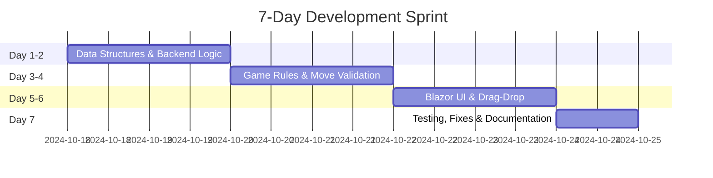

# <div align="center">🃏 **SOLITAIRE GAME - KLONDIKE EDITION** 🃏</div>

<!-- ✅ Typing Animation -->
<div align="center">
  
</div>

<div align="center">
  
</div>

<!-- 🖼️ Game GIF -->
<div align="center">
  
</div>

---

##  **About The Project**

```javascript
const SolitaireGame = {
    name: "Klondike Solitaire",
    course: "CSC200 - Data Structure & Algorithms",
    developer: "NADIR JAMAL",
    rollNumber: "2024-CS-38",
    currentStatus: "Blazor WebAssembly Implementation ✅",
    platform: "Web-Based (Blazor WASM) 🚀",
    techStack: ["C#", ".NET 8.0", "Blazor WebAssembly", "Custom Data Structures"],
    specialFeature: "100% Custom DS Implementation (No built-in collections!)",
    playReference: "https://solitaired.com/",
    motto: "Learn by Building, Master by Playing! 🎯"
};

console.log("🎴 Welcome to the ultimate Solitaire experience! 🎴");
```

<div align="center">
  
  
  
  
  
</div>

---

##  **Table of Contents**

- [🎲 Game Rules](#-game-rules)
- [✨ Features Implemented](#-features-implemented)
- [🏗️ Data Structures Used](#️-data-structures-used)
- [💻 Technology Stack](#-technology-stack)
- [📁 Project Structure](#-project-structure)
- [🚀 Installation & Setup](#-installation--setup)
- [🎮 How to Play](#-how-to-play)
- [🎯 Implementation Details](#-implementation-details)
- [🧪 Testing Guidelines](#-testing-guidelines)
- [🗺️ Development Journey](#️-development-journey)
- [📊 Project Statistics](#-project-statistics)
- [🤝 Contributing](#-contributing)
- [📄 License](#-license)
- [📧 Contact & Support](#-contact--support)

---

##  **Game Rules**

### 🎯 **Objective**
Move all 52 cards to the four foundation piles, building each pile from Ace to King in the same suit.

<div align="center">
<table>
<tr>
<td width="25%">

### 🏗️ **Setup**
```yaml
Tableau: 7 piles
  - Pile 1: 1 card
  - Pile 2: 2 cards
  - Pile 3: 3 cards
  - ...
  - Pile 7: 7 cards
  
Top card: Face up
Others: Face down
```

</td>
<td width="25%">

### 📚 **Stock Pile**
```yaml
Remaining: 24 cards
Draw mode: 3 cards at a time
Location: Top-left
Action: Click to draw
Refill: Auto from waste pile
```

</td>
<td width="25%">

### 🗑️ **Waste Pile**
```yaml
Purpose: Drawn cards area
Cards: Face up
Visible: All 3 cards side-by-side
Source: Stock pile
Usage: Drag any of 3 cards
Auto-draw: Yes (keeps 3 cards)
```

</td>
<td width="25%">

### 🏆 **Foundation**
```yaml
Piles: 4 (one per suit)
Start: Ace
End: King
Order: Ascending
Rule: Same suit only
```

</td>
</tr>
</table>
</div>

### ✅ **Valid Moves**

<div align="center">

| From → To | Rule | Example |
|:---:|:---|:---|
| 🎴 **Tableau → Tableau** | Alternating colors, descending rank | ❤️ Red 7 on ♠️ Black 8 |
| 🎴 **Tableau → Foundation** | Same suit, ascending from Ace | ♠️ Ace, then ♠️ 2, ♠️ 3... |
| 🎴 **Stock → Waste** | Draw 3 cards | Click stock pile |
| 🎴 **Waste → Tableau** | Follow tableau rules | Drag any of 3 cards |
| 🎴 **Waste → Foundation** | Follow foundation rules | Drag or double-click |

</div>

### 🏅 **Win Condition**
```diff
+ All 52 cards moved to foundation piles
+ Each foundation has 13 cards (Ace → King)
+ All cards in correct suit order
+ Tableau and stock piles are empty
```

---

##  **Features Implemented**

<div align="center">
<table>
<tr>
<td width="50%">

### ✅ **Core Features**
```diff
+ ✅ Complete Klondike rule implementation
+ ✅ 52-card deck with Fisher-Yates shuffle
+ ✅ Custom data structures (Stack, Queue, LinkedList)
+ ✅ Tableau dealing (7 piles, 28 cards)
+ ✅ Stock pile with draw-3 mode
+ ✅ Waste pile with 3 cards visible side-by-side
+ ✅ Auto-draw from stock when waste card removed
+ ✅ Foundation pile building (Ace → King)
+ ✅ Valid move detection & enforcement
+ ✅ Card flipping logic
+ ✅ Win condition checking with modal
+ ✅ Full drag & drop functionality
+ ✅ Double-click to move to foundation
```

</td>
<td width="50%">

### ✅ **UI/UX Features**
```diff
+ ✅ Beautiful gradient background
+ ✅ Responsive design (desktop/tablet/mobile)
+ ✅ Smooth card animations
+ ✅ Hover effects on cards
+ ✅ Color-coded cards (Red/Black)
+ ✅ Suit symbols (♥ ♦ ♣ ♠)
+ ✅ Move counter tracking
+ ✅ Game timer (MM:SS format)
+ ✅ New Game button
+ ✅ Undo/Redo functionality
+ ✅ Auto-complete feature
+ ✅ Win celebration modal
```

</td>
</tr>
</table>
</div>

---

##  **Data Structures Used**

<div align="center">

This project implements **custom data structures from scratch** - no built-in .NET collections used!

</div>

<div align="center">
<table>
<tr>
<td width="33%">

### 📚 **Stack (LIFO)**


```csharp
MyStack<Card>
├── Push(item)
├── Pop()
├── Peek()
├── IsEmpty()
├── Count
└── ToListReversed()
```

**🎯 Used For:**
- Tableau piles (7 columns)
- Foundation piles (4 suits)
- Undo/Redo history
- Card movement tracking

**📄 File:** `MyStack.cs`

</td>
<td width="33%">

### 🎯 **Queue (FIFO)**


```csharp
MyQueue<Card>
├── Enqueue(item)
├── Dequeue()
├── GetFront()
├── IsEmpty()
└── Count
```

**🎯 Used For:**
- Stock pile (draw pile)
- Card drawing order
- Waste pile refill
- Sequential card access

**📄 File:** `MyQueue.cs`

</td>
<td width="33%">

### 🔗 **Linked List**


```csharp
MyLinkedList<Card>
├── AddFirst(item)
├── AddLast(item)
├── Remove(item)
├── Clear()
├── ToList()
└── Count
```

**🎯 Used For:**
- Initial deck creation
- Waste pile management
- Flexible card collections
- Dynamic card manipulation

**📄 File:** `Node.cs`

</td>
</tr>
</table>
</div>

---

##  **Technology Stack**

<div align="center">

### 🔧 **Current Implementation**


</div>

<div align="center">
<table>
<tr>
<td align="center" width="33%">

### 🎨 **Backend**
```yaml
Language: C# 11.0
Framework: .NET 8.0
Architecture: OOP & SOLID principles
Patterns: Command Pattern (Undo/Redo)
Data Structures: 100% Custom
```


</td>
<td align="center" width="33%">

### 🖼️ **Frontend**
```yaml
Platform: Blazor WebAssembly
UI Framework: Blazor Components
Styling: CSS3 (Embedded in index.html)
Rendering: Client-side
Responsive: Yes
```


</td>
<td align="center" width="33%">

### 🛠️ **Tools**
```yaml
IDE: Visual Studio 2022
VCS: Git & GitHub
Runtime: WebAssembly
Hosting: Any static host
Browser: Modern browsers
```


</td>
</tr>
</table>
</div>

---

##  **Project Structure**

```
SolitaireGame/
│
├── 📂 Backend/                          # Core game logic
│   ├── Cards.cs                         # Card representation (Suit, Rank, Color)
│   ├── Commands.cs                      # Command pattern for Undo/Redo
│   ├── Deck.cs                          # 52-card deck with shuffle
│   ├── Foundation.cs                    # Single foundation pile
│   ├── FoundationPile.cs                # Container for 4 foundations
│   ├── Movemanager.cs                   # Move orchestration & validation
│   ├── TableauPile.cs                   # Single tableau column
│   ├── TableauPiles.cs                  # Container for 7 tableau piles
│   ├── StockPile.cs                     # Draw pile (Queue-based)
│   └── WastePile.cs                     # Discard pile (LinkedList-based)
│
├── 📂 DataStructures/                   # Custom implementations
│   ├── Node.cs                          # Generic node + MyLinkedList
│   ├── MyStack.cs                       # Custom stack (LIFO)
│   └── MyQueue.cs                       # Custom queue (FIFO)
│
├── 📂 Pages/                            # Blazor Pages
│   └── Solitaire.razor                  # Main game component
│
├── 📂 Shared/                           # Shared components
│   └── MainLayout.razor                 # Layout wrapper
│
├── 📂 wwwroot/                          # Static assets
│   └── index.html                       # Entry point with embedded CSS
│
├── _Imports.razor                       # Global imports
├── App.razor                            # Root component
├── Program.cs                           # Application entry point
├── README.md                            # This file
└── .gitignore                           # Git ignore rules
```

---

##  **Installation & Setup**

### 📋 **Prerequisites**

```yaml
Required:
  - .NET 8.0 SDK or higher
  - Visual Studio 2022 (or VS Code with C# extension)
  - Git (for cloning)
  - Modern web browser (Chrome, Firefox, Edge)

Recommended:
  - 4GB RAM minimum
  - 500MB free disk space
  - 1920x1080 screen resolution
```

### 📥 **Installation Steps**

```bash
# 1️⃣ Clone the repository
git clone https://github.com/NADIR38/SolitaireGame.git
cd SolitaireGame

# 2️⃣ Open in Visual Studio
# Double-click SolitaireGame.sln

# 3️⃣ Restore NuGet packages (automatic in VS)
# Or manually: dotnet restore

# 4️⃣ Build the solution
dotnet build
# Or in Visual Studio: Press Ctrl+Shift+B

# 5️⃣ Run the application
dotnet run
# Or in Visual Studio: Press F5

# 6️⃣ Open browser
# Navigate to: https://localhost:7033/solitaire
# Or the URL shown in console
```

### 🌐 **Alternative: Run from Command Line**

```bash
# Navigate to project directory
cd SolitaireGame

# Clean previous builds
dotnet clean

# Build the project
dotnet build

# Run the application
dotnet run

# The app will open in your default browser
# Or navigate to: https://localhost:7033/solitaire
```

### ⚠️ **Troubleshooting**

<details>
<summary><b>Build Errors</b></summary>

```bash
# If you get build errors, try:
dotnet clean
dotnet restore
dotnet build

# Check .NET version
dotnet --version
# Should be 8.0 or higher
```
</details>

<details>
<summary><b>Port Already in Use</b></summary>

```bash
# If port 7033 is in use, edit launchSettings.json
# Or run with different port:
dotnet run --urls "https://localhost:5001"
```
</details>

<details>
<summary><b>CSS Not Loading</b></summary>

```bash
# Hard refresh browser:
# Windows: Ctrl + Shift + R
# Mac: Cmd + Shift + R

# Or clear browser cache
```
</details>

---

##  **How to Play**

### 🎯 **Game Controls**

<div align="center">

| Action | Control | Description |
|:---:|:---:|:---|
| 🖱️ **Drag & Drop** | Left Click + Drag | Drag cards to valid destinations |
| 📚 **Draw Cards** | Click Stock Pile | Draw 3 cards from stock to waste |
| 🎯 **Quick Move** | Double-Click | Auto-move card to foundation if valid |
| ↩️ **Undo** | Undo Button | Undo last move |
| ↪️ **Redo** | Redo Button | Redo undone move |
| 🔄 **New Game** | New Game Button | Start fresh game with shuffle |
| ⚡ **Auto Complete** | Auto Complete Button | Finish game automatically |

</div>

### 📖 **Gameplay Guide**

<div align="center">
<table>
<tr>
<td width="50%">

#### 🎴 **Moving Cards**
```diff
+ Drag cards from waste or tableau
+ Drop on valid tableau or foundation
+ Only face-up cards can be moved
+ Kings go to empty tableau piles
+ Any of 3 waste cards can be dragged
+ Cards auto-flip when revealed
```

#### 📚 **Stock & Waste Piles**
```diff
+ Click stock to draw 3 cards
+ All 3 cards visible side-by-side
+ Drag any of the 3 cards
+ Auto-draws next card when one removed
+ Stock recycles from waste when empty
```

</td>
<td width="50%">

#### 🏆 **Foundation Building**
```diff
+ Start with Ace of each suit
+ Build up to King (A→2→3...→K)
+ Same suit only
+ Double-click for quick move
+ Win when all 4 foundations complete
```

#### 🎯 **Pro Tips**
```diff
+ Uncover face-down cards first
+ Create empty tableau slots early
+ Move Aces to foundation ASAP
+ Plan moves ahead
+ Use undo to experiment
+ Auto-complete saves time!
```

</td>
</tr>
</table>
</div>

### 🌟 **Special Features**

<details>
<summary><b>Waste Pile Innovation</b></summary>

Unlike traditional Solitaire:
- **All 3 drawn cards visible side-by-side** (not stacked)
- **Drag ANY of the 3 cards** (not just top one)
- **Auto-draw maintains 3 cards** when you move one
- **Better visibility** - no card overlap
</details>

<details>
<summary><b>Undo/Redo System</b></summary>

Implemented using Command Pattern:
- **Unlimited undo/redo** moves
- **Tracks all actions** including card flips
- **Restores exact state** of game
- **Clears redo** on new moves
</details>

<details>
<summary><b>Auto-Complete</b></summary>

Smart finishing system:
- **Enabled** when all cards face-up
- **Automatically moves** cards to foundations
- **Fast-forwards** to victory
- **Counts moves** properly
</details>

---

##  **Implementation Details**

### 🎯 **Key Algorithms**

<div align="center">
<table>
<tr>
<td width="50%">

#### 🔀 **Fisher-Yates Shuffle**
```csharp
// O(n) time complexity
// Unbiased random shuffle
public void ShuffleCards(MyLinkedList<Card> cards) {
    List<Card> list = cards.ToList();
    for (int i = list.Count - 1; i > 0; i--) {
        int j = rand.Next(i + 1);
        (list[i], list[j]) = (list[j], list[i]);
    }
    cards.Clear();
    foreach (var card in list)
        cards.AddLast(card);
}
```

</td>
<td width="50%">

#### ✅ **Move Validation**
```csharp
// Tableau: Alternating colors, descending
private bool IsValidTableauMove(Card card, Card target) {
    if (target == null) 
        return card.Rank == Rank.King;
    
    return card.Color != target.Color &&
           (int)target.Rank - (int)card.Rank == 1;
}

// Foundation: Same suit, ascending
private bool IsValidFoundationMove(Card card, Foundation f) {
    if (f.Count == 0) 
        return card.Rank == Rank.Ace;
    
    Card top = f.Peek();
    return card.Suit == top.Suit &&
           (int)card.Rank == (int)top.Rank + 1;
}
```

</td>
</tr>
</table>
</div>

### 🎨 **Command Pattern (Undo/Redo)**

```csharp
public class Commands {
    public Action Execute { get; set; }
    public Action Undo { get; set; }
}

// Recording moves
private void RecordMove(Commands command) {
    UndoStack.Push(command);
    RedoStack.Clear(); // Clear redo on new move
}

// Example: Moving card with undo support
RecordMove(new Commands(
    Execute: () => {
        waste.RemoveCard(card);
        tableau.AddCard(card);
    },
    Undo: () => {
        tableau.RemoveCard(card);
        waste.AddCard(card);
    }
));
```

### 🔄 **Auto-Draw System**

```csharp
private void AutoDrawFromStock() {
    var wasteCards = wastePile.GetAllCards();
    
    // Keep waste at 3 cards
    if (wasteCards.Count < 3 && stockPile.Count > 0) {
        Card drawnCard = stockPile.DrawOne();
        if (drawnCard != null) {
            wastePile.AddCard(drawnCard);
        }
    }
}
```

---

##  **Testing Guidelines**

### ✅ **Manual Testing Checklist**

<div align="center">

| Feature | Test Case | Status |
|:---|:---|:---:|
| 🎴 **Card Display** | All 52 cards render correctly | ✅ |
| 🔀 **Shuffle** | Cards are randomized each game | ✅ |
| 📚 **Draw Stock** | 3 cards appear in waste | ✅ |
| 🎯 **Drag & Drop** | Cards move to valid destinations | ✅ |
| ❌ **Invalid Moves** | Invalid drops are rejected | ✅ |
| 🔄 **Auto-Draw** | Waste refills when card removed | ✅ |
| ↩️ **Undo/Redo** | Moves can be undone/redone | ✅ |
| 🏆 **Win Detection** | Game detects victory | ✅ |
| ⚡ **Auto-Complete** | Finishes game automatically | ✅ |
| 📱 **Responsive** | Works on mobile/tablet | ✅ |

</div>

### 🐛 **Known Issues**

```diff
- None currently! 🎉
+ All major features working
+ Tested on Chrome, Firefox, Edge
+ Mobile-friendly design
```

---

##  **Development Roadmap**

### ✅ **Completed (v1.0)**

- [x] Custom data structures (Stack, Queue, LinkedList)
- [x] Complete backend game logic
- [x] Blazor WebAssembly frontend
- [x] Drag & drop functionality
- [x] Beautiful responsive UI
- [x] Undo/Redo system
- [x] Auto-complete feature
- [x] Win detection & celebration
- [x] Timer & move counter
- [x] Auto-draw from stock


---

##  **Project Statistics**

<div align="center">

### 📈 **Development Metrics**


</div>

<div align="center">
<table>
<tr>
<td align="center" width="33%">

### 📁 **File Statistics**
```yaml
Total Files: 20+
Backend: 10 files
Data Structures: 3 files
Frontend: 5 files
Documentation: 2 files
```

</td>
<td align="center" width="33%">

### 💻 **Code Metrics**
```yaml
C# Backend: ~2500 LOC
Blazor UI: ~800 LOC
CSS: ~400 lines
Comments: ~600 lines
Documentation: ~1500 lines
```

</td>
<td align="center" width="33%">

### ⏱️ **Time Investment**
```yaml
Total Development: 7 days
Backend + DS: ~3 days
Frontend + UI: ~2 days
Testing + Fixes: ~1 day
Documentation: ~1 day
Total Hours: ~80-90 hours
```

</td>
</tr>
</table>
</div>

---

##  **Contributing**

We welcome contributions from the community! Here's how you can help:

### 🌟 **Ways to Contribute**

<div align="center">

| Contribution Type | Description | Difficulty |
|:---:|:---|:---:|
| 🐛 **Bug Reports** | Report bugs via GitHub Issues | Easy |
| 💡 **Feature Requests** | Suggest new features or improvements | Easy |
| 📝 **Documentation** | Improve README, comments, or guides | Easy |
| 🎨 **UI/UX Design** | Enhance visual design and user experience | Medium |
| 🔧 **Code Contributions** | Fix bugs or implement features | Medium-Hard |
| 🧪 **Testing** | Write unit tests or integration tests | Medium |
| 🌍 **Translation** | Add language support | Easy-Medium |

</div>

### 📝 **Contribution Guidelines**

1. **Fork the Repository**
   ```bash
   git clone https://github.com/NADIR38/SolitaireGame.git
   cd SolitaireGame
   ```

2. **Create a Feature Branch**
   ```bash
   git checkout -b feature/YourAmazingFeature
   ```

3. **Make Your Changes**
   - Follow C# coding conventions
   - Add comments for complex logic
   - Maintain code consistency
   - Test your changes thoroughly

4. **Commit Your Changes**
   ```bash
   git add .
   git commit -m "✨ Add: Your amazing feature description"
   ```
   
   **Commit Message Convention:**
   - ✨ `Add:` New feature
   - 🐛 `Fix:` Bug fix
   - 📝 `Docs:` Documentation
   - 🎨 `Style:` Formatting
   - ♻️ `Refactor:` Code restructuring
   - ⚡ `Perf:` Performance improvement
   - 🧪 `Test:` Adding tests

5. **Push to Your Fork**
   ```bash
   git push origin feature/YourAmazingFeature
   ```

6. **Open a Pull Request**
   - Provide clear description of changes
   - Reference any related issues
   - Include screenshots for UI changes
   - Wait for review and feedback

### 🎯 **Code Standards**

```csharp
// ✅ Good Practice
public class CardManager 
{
    private MyStack<Card> deck;
    
    /// <summary>
    /// Shuffles the deck using Fisher-Yates algorithm
    /// </summary>
    public void Shuffle() 
    {
        // Implementation with comments
    }
}

// ❌ Avoid
public class cardmanager {
    private MyStack<Card> d;
    public void s() { /* no comments */ }
}
```

### 🏆 **Contributors**

<div align="center">

Special thanks to all contributors who help improve this project!

<a href="https://github.com/NADIR38/SolitaireGame/graphs/contributors">
  
</a>

</div>

---

##  **License**

<div align="center">

```
MIT License

Copyright (c) 2024 NADIR JAMAL

Permission is hereby granted, free of charge, to any person obtaining a copy
of this software and associated documentation files (the "Software"), to deal
in the Software without restriction, including without limitation the rights
to use, copy, modify, merge, publish, distribute, sublicense, and/or sell
copies of the Software, and to permit persons to whom the Software is
furnished to do so, subject to the following conditions:

The above copyright notice and this permission notice shall be included in all
copies or substantial portions of the Software.

THE SOFTWARE IS PROVIDED "AS IS", WITHOUT WARRANTY OF ANY KIND, EXPRESS OR
IMPLIED, INCLUDING BUT NOT LIMITED TO THE WARRANTIES OF MERCHANTABILITY,
FITNESS FOR A PARTICULAR PURPOSE AND NONINFRINGEMENT. IN NO EVENT SHALL THE
AUTHORS OR COPYRIGHT HOLDERS BE LIABLE FOR ANY CLAIM, DAMAGES OR OTHER
LIABILITY, WHETHER IN AN ACTION OF CONTRACT, TORT OR OTHERWISE, ARISING FROM,
OUT OF OR IN CONNECTION WITH THE SOFTWARE OR THE USE OR OTHER DEALINGS IN THE
SOFTWARE.
```

[](https://opensource.org/licenses/MIT)

</div>

---

##  **Contact & Support**

<div align="center">

### 💬 **Get in Touch**

**NADIR JAMAL** | 2024-CS-38

[](https://github.com/NADIR38)
[](https://www.linkedin.com/in/nadir-jamal-6b5833370/)
[](mailto:jamalnadir7778@gmail.com)
[](https://685b7dbaacf12c1d1241cc28--loquacious-pika-849dea.netlify.app/)

### 🎓 **Academic Info**

```yaml
Institution: University of Engineering & Technology (UET) Lahore
Program: BS Computer Science
Course: CSC200 - Data Structure & Algorithms
Instructor: Nazeef Ul Haq
Roll Number: 2024-CS-38
Semester: Fall 2024
Project Type: Academic Assignment
Grade: Pending Evaluation
```

### 💡 **Support This Project**

<table>
<tr>
<td align="center" width="33%">

### ⭐ **Star on GitHub**
Show your support by starring the repository!

[](https://github.com/NADIR38/SolitaireGame)

</td>
<td align="center" width="33%">

### 🔔 **Watch for Updates**
Get notified about new releases and updates!

[](https://github.com/NADIR38/SolitaireGame)

</td>
<td align="center" width="33%">

### 🍴 **Fork & Contribute**
Create your own version or contribute back!

[](https://github.com/NADIR38/SolitaireGame/fork)

</td>
</tr>
</table>

### 📮 **Report Issues**

Found a bug or have a suggestion? [Open an issue](https://github.com/NADIR38/SolitaireGame/issues/new) on GitHub!

### 🙋 **FAQ**

<details>
<summary><b>Q: Can I use this project for my own assignment?</b></summary>

A: This project is open-source under MIT License. However, please follow your institution's academic integrity policies. Use it as a reference or learning material, but ensure you understand and write your own code.
</details>

<details>
<summary><b>Q: How do I deploy this game online?</b></summary>

A: You can deploy to:
- **GitHub Pages**: Free static hosting
- **Netlify**: Automatic deployment from Git
- **Azure Static Web Apps**: Microsoft's free tier
- **Vercel**: Simple deployment for web apps

Just build the project and deploy the `wwwroot` folder.
</details>

<details>
<summary><b>Q: Can I add multiplayer features?</b></summary>

A: Yes! You can use SignalR for real-time communication. This would require backend server implementation and more complex state management.
</details>

<details>
<summary><b>Q: Is this project still maintained?</b></summary>

A: Yes! This is an active academic project. Updates and improvements are ongoing based on feedback and requirements.
</details>

<details>
<summary><b>Q: Can I contribute even if I'm a beginner?</b></summary>

A: Absolutely! Contributions of all levels are welcome. Start with documentation improvements, bug reports, or simple feature enhancements.
</details>

</div>

---

##  **Learning Resources**

<div align="center">

### 🎓 **Educational Materials**

This project demonstrates various CS concepts. Here are resources to learn more:

<table>
<tr>
<td align="center" width="50%">

### 📖 **Data Structures**
- [Stack Implementation](https://www.geeksforgeeks.org/stack-data-structure/)
- [Queue Implementation](https://www.geeksforgeeks.org/queue-data-structure/)
- [Linked List Basics](https://www.geeksforgeeks.org/data-structures/linked-list/)
- [Big O Notation](https://www.bigocheatsheet.com/)

</td>
<td align="center" width="50%">

### 🎮 **Game Development**
- [Blazor Documentation](https://docs.microsoft.com/en-us/aspnet/core/blazor/)
- [Command Pattern](https://refactoring.guru/design-patterns/command)
- [Fisher-Yates Shuffle](https://en.wikipedia.org/wiki/Fisher%E2%80%93Yates_shuffle)
- [Drag and Drop API](https://developer.mozilla.org/en-US/docs/Web/API/HTML_Drag_and_Drop_API)

</td>
</tr>
</table>

### 📺 **Video Tutorials**

| Topic | Resource | Duration |
|:---:|:---|:---:|
| C# Basics | [Microsoft Learn](https://docs.microsoft.com/en-us/learn/paths/csharp-first-steps/) | 8 hours |
| Blazor WebAssembly | [Blazor Tutorial](https://www.youtube.com/results?search_query=blazor+webassembly+tutorial) | Various |
| Data Structures | [CS Dojo](https://www.youtube.com/c/CSDojo) | Various |
| OOP in C# | [Programming with Mosh](https://www.youtube.com/c/programmingwithmosh) | Various |

</div>

---

##  **Acknowledgments**

<div align="center">

### 🙏 **Special Thanks To**

```yaml
Course Instructor:
  - Nazeef Ul Haq (CSC200 - Data Structure & Algorithms)
  - For providing guidance and project requirements

UET Lahore:
  - University of Engineering & Technology, Lahore
  - For academic support and resources

Open Source Community:
  - Microsoft .NET Team (Blazor Framework)
  - GitHub (Version Control & Hosting)
  - Stack Overflow (Problem Solving)

Inspiration:
  - Classic Solitaire Games
  - Modern Web Technologies
  - Clean Code Principles
```

### 🌟 **Built With Love**

This project represents countless hours of learning, coding, debugging, and refining. It's more than just a card game—it's a journey through data structures, algorithms, and modern web development.

### 💖 **Dedication**

*Dedicated to all students learning Data Structures and Algorithms. May this project inspire you to build something amazing!*

</div>

---

##  **Development Journey**

<div align="center">

### ⚡ **Built in 7 Days - A Speed Development Challenge!**



### 🎯 **Development Timeline**


### 🚀 **What Was Built Each Day**

| Day | Focus Area | Achievements |
|:---:|:---|:---|
| **1** | **Custom Data Structures** | Stack, Queue, LinkedList implementations |
| **2** | **Backend Foundation** | Card class, Deck, Shuffle algorithm |
| **3** | **Game Logic** | Tableau, Foundation, Stock/Waste piles |
| **4** | **Move System** | Validation, Undo/Redo, Command pattern |
| **5** | **Blazor Setup** | Component structure, Responsive UI |
| **6** | **Interactive Features** | Drag-drop, Double-click, Auto-complete |
| **7** | **Final Polish** | Testing, Bug fixes, README documentation |

### 💡 **Key Challenges Overcome**

```diff
+ Complex drag-drop state management
+ Undo/Redo command pattern implementation  
+ Waste pile auto-draw mechanism
+ Win condition detection logic
+ Responsive design for all screen sizes
```

</div>

### 🎯 **Achievement Unlocked!**


</div>

---

<div align="center">


### 🎴 *"Every expert was once a beginner. Keep coding, keep learning!"* 🎴

<br>

**Made with ❤️ by [NADIR JAMAL](https://github.com/NADIR38)**

<br>


<br>

### 🌟 If you found this project helpful, please consider giving it a star! 🌟

[](https://star-history.com/#NADIR38/SolitaireGame&Date)

<br>

**© 2024 NADIR JAMAL | UET Lahore | CSC200 Project**


---

<sub>🎯 Project Status: **Completed & Fully Functional** | 📅 Last Updated: **October 2024** | 🚀 Version: **1.0.0**</sub>

</div>